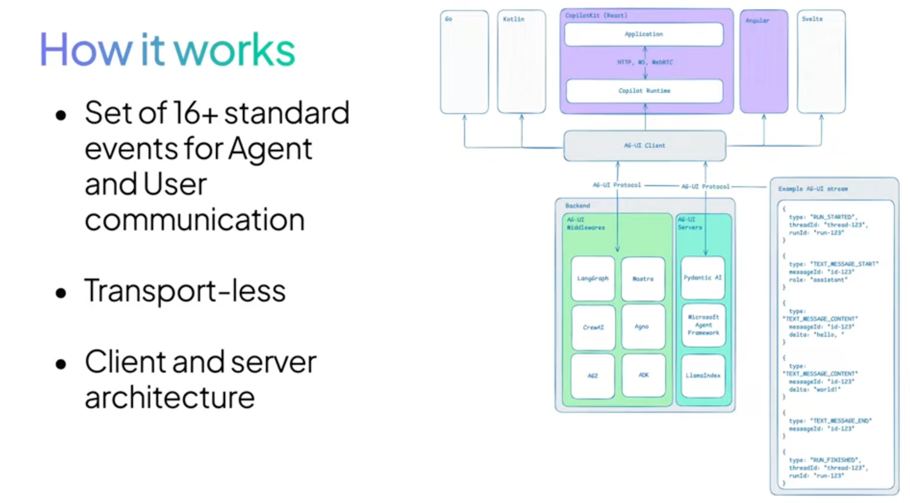
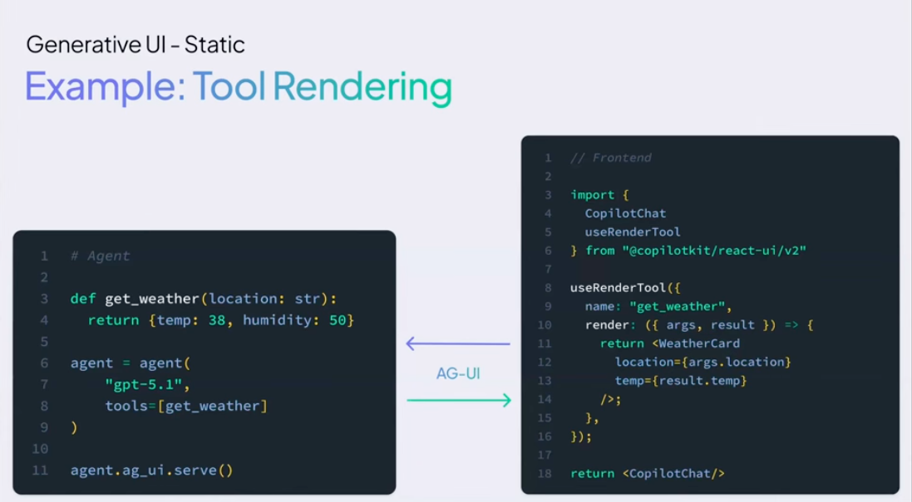
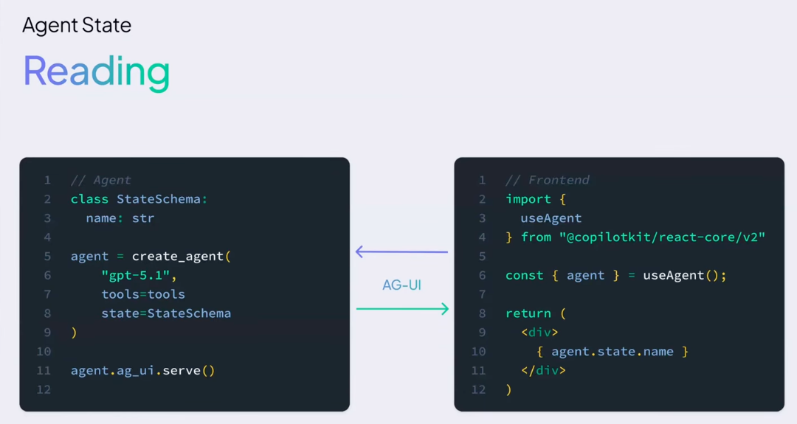
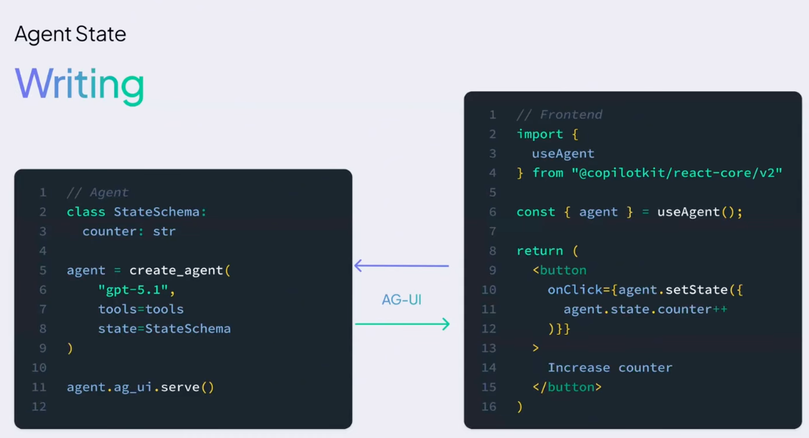

## static generative UI

In CopilotKit, static generative UI is a pattern where the AI agent does not create new UI layouts. Instead, it chooses from predefined UI components that developers already built.

Think of it like this:

Developers build a library of UI components (cards, tables, charts, forms).

The AI agent decides which component to show.

The agent fills it with data, but cannot invent new UI


There are **3 main types of Generative UI** used in AI applications and frameworks like CopilotKit. ([CopilotKit][1])

---

> Generative UI: Specs, Patterns, and the Protocols Behind Them (MCP Apps, A2UI, AG-UI)  

AG-UI and A2UI  
https://www.copilotkit.ai/ag-ui-and-a2ui  
AG-UI is the Agent–User Interaction protocol which connects your user-facing application to any agentic backend.

A2UI is a Declarative Generative UI spec, originated by Google, which agents can use to return UI widgets as part of their responses.

# 3 Types of Generative UI

## 1️⃣ Static Generative UI

**Definition:**
The AI **selects from prebuilt UI components** created by developers.

**How it works**

* Developer builds components (cards, tables, charts).
* AI chooses which component to render.
* AI fills it with data.

**Example**
User asks:

> “Show me today’s weather.”

AI selects:

```
WeatherCard(city="NYC", temp="72°F")
```

✅ Pros

* Consistent design
* Safe and predictable
* Easy to maintain

❌ Cons

* Low flexibility
* High coupling between Frontend and backend.
* Developers must build every component beforehand

This is **most common in production apps**. ([CopilotKit][2])



---

## 2️⃣ Declarative Generative UI

**Definition:**
The AI **describes the UI structure using a schema**, and the frontend renders it.

Instead of selecting a component directly, the AI sends something like:

```json
{
  "type": "card",
  "title": "Weather",
  "content": {
    "city": "NYC",
    "temp": "72°F"
  }
}
```

The frontend then converts that **JSON specification → UI**.

 **A2UI is specifically designed for declarative UI**, not for other generative UI styles.

## Short answer

✅ **Yes:** A2UI is built **only for declarative generative UI**.
❌ It is **not used for static UI selection or open-ended UI generation**.

---

# Why A2UI is declarative-only

The core design of **A2UI (Agent-to-UI)** is that the **agent describes the UI as structured data (JSON)** and the **client renders it using predefined components**. ([A2UI][1])

Key rule:

* The agent **cannot generate HTML, CSS, or executable code**
* The agent **only sends a declarative component description**
* The client renders using its **trusted component catalog**. ([Google Developers Blog][2])

Example idea:

```json
{
  "surfaceUpdate": {
    "components": [
      {
        "type": "Card",
        "props": {
          "title": "Restaurant",
          "rating": 4.5
        }
      }
    ]
  }
}
```

Here the agent **declares what UI should exist**, but the **frontend decides how to render it**.

---

# How A2UI fits into Generative UI types

| Generative UI Type        | Example                               | Uses A2UI? |
| ------------------------- | ------------------------------------- | ---------- |
| Static Generative UI      | AI chooses from predefined components | ❌ No       |
| Declarative Generative UI | AI describes UI using JSON schema     | ✅ Yes      |
| Open-ended Generative UI  | AI generates HTML/JS/React code       | ❌ No       |

So **A2UI belongs only to the Declarative UI category**.

---

# What A2UI actually provides

A2UI defines:

* **Component descriptions**
* **UI surfaces (areas like sidebar or main panel)**
* **Data models**
* **Streaming UI updates**

Agents send **JSON messages** like:

* `surfaceUpdate`
* `dataModelUpdate`
* `createSurface` ([A2UI][3])

These messages let the client **incrementally build the UI**.

---

# Simple way to remember

**A2UI = AI describes UI (data)**
**Frontend = renders UI (code)**

```
Agent
   ↓
A2UI JSON (declarative UI spec)
   ↓
Client Renderer
   ↓
React / Flutter / Native UI
```

---

✅ **Conclusion:**
**A2UI is specifically designed for declarative generative UI and not for other generative UI approaches.**

---

If you're studying **CopilotKit / AG-UI**, I can also explain something that makes this much clearer:

**The 4-layer agent UI stack used in modern AI apps (2025–2026)**

```
Agent
↓
AG-UI (transport protocol)
↓
A2UI (UI specification)
↓
Frontend Renderer
```

Once you understand this stack, **generative UI architecture becomes very clear.**

[1]: https://a2ui.org/?utm_source=chatgpt.com "A2UI"
[2]: https://developers.googleblog.com/introducing-a2ui-an-open-project-for-agent-driven-interfaces/?utm_source=chatgpt.com "Introducing A2UI: An open project for agent-driven interfaces - Google Developers Blog"
[3]: https://a2ui.org/specification/v0.9-a2ui/?utm_source=chatgpt.com "A2UI Specification - A2UI"


✅ Pros

* More flexible than static
* Still structured and safe

❌ Cons

* Limited to schema vocabulary

Common standards:

* **A2UI**
* **Open-JSON-UI** ([CopilotKit][3])

---

## 3️⃣ Open-Ended (Fully Generated) UI

**Definition:**
The AI **generates the entire UI**, often as **HTML/CSS or an embedded app**.

Example:

```
<html>
  <div class="dashboard">
     ...
  </div>
</html>
```

✅ Pros

* Maximum flexibility
* Can generate completely new interfaces

❌ Cons

* Hard to control styling
* Security risks and performance concerns
* Inconsistent UX
* Typical web-first experience, difficult to port to native.

Usually used for:

* prototypes
* AI-generated pages
* experimental apps ([CopilotKit][2])

---

# Simple way to remember

| Type        | Who controls UI | Flexibility |
| ----------- | --------------- | ----------- |
| Static      | Developer       | Low         |
| Declarative | Shared          | Medium      |
| Open-ended  | AI              | High        |

---

✅ **In practice:**
Most real products use **Static or Declarative Generative UI** because they are safer and easier to maintain. ([CopilotKit][2])

---


[1]: https://www.copilotkit.ai/generative-ui?utm_source=chatgpt.com "Generative UI: Understanding Agent-Powered Interfaces | CopilotKit"
[2]: https://www.copilotkit.ai/blog/the-three-kinds-of-generative-ui?utm_source=chatgpt.com "The Three Types of Generative UI: Static, Declarative and Fully Generated | Blog | CopilotKit"
[3]: https://www.copilotkit.ai/blog/the-developer-s-guide-to-generative-ui-in-2026?utm_source=chatgpt.com "The Developer's Guide to Generative UI in 2026 | Blog | CopilotKit"


## AG UI
**AG-UI (Agent–User Interaction Protocol)** supports the **interaction layer between an AI agent and a user-facing application**. In other words, it handles **how agents communicate with frontends** (web apps, copilots, dashboards, etc.). ([docs.ag-ui.com][1])

https://github.com/ag-ui-protocol/ag-ui


Think of it as the **protocol that connects the agent backend to the UI frontend**.

---

# What AG-UI Supports

AG-UI supports several core capabilities used in modern **AI agent applications**.

## 1️⃣ Streaming Chat & Responses

* Agents can **stream responses token-by-token** in real time.
* The UI can display text as it is generated. ([Microsoft Learn][2])

Example:

```
TEXT_MESSAGE_START
TEXT_MESSAGE_CONTENT
TEXT_MESSAGE_END
```

---

## 2️⃣ Tool Calls & Tool Results

Agents can **call tools and APIs**, and AG-UI streams the events to the UI.

Example events:

```
TOOL_CALL_START
TOOL_CALL_ARGS
TOOL_CALL_RESULT
TOOL_CALL_END
```

This allows the UI to show:

* loading states
* progress
* results from tools. ([docs.ag2.ai][3])

---

## 3️⃣ Generative UI

AG-UI supports **agent-generated UI components**.

Two forms:

* **Agentic Generative UI**
* **Tool-based Generative UI**

The agent can send UI instructions and the frontend renders components. ([Microsoft Learn][2])

---

## 4️⃣ Shared State (Client ↔ Agent)

AG-UI supports **bidirectional state synchronization**.

Example:

```
STATE_SNAPSHOT
STATE_DELTA
```

This keeps:

* frontend state
* agent state

in sync without resending everything. ([docs.ag2.ai][3])

---

## 5️⃣ Human-in-the-Loop Workflows

Agents can **ask users for approval or input** before executing actions.

Example:

* approve a transaction
* confirm sending an email
* confirm running a workflow. ([Microsoft Learn][2])

---

## 6️⃣ Real-Time Agent Events

AG-UI streams lifecycle events such as:

```
RUN_STARTED
RUN_FINISHED
RUN_ERROR
```

The UI can react instantly (loading, error messages, etc.). ([docs.ag2.ai][3])

---

## 7️⃣ Multimodal Interaction

AG-UI supports attachments like:

* files
* images
* audio
* transcripts

This allows **multimodal agent interfaces**. ([docs.ag-ui.com][1])

---

# The 7 Main Features AG-UI Supports

According to the protocol specification:

1. Agentic Chat
2. Backend Tool Rendering
3. Human-in-the-Loop interactions
4. Agentic Generative UI
5. Tool-based Generative UI
6. Shared State synchronization
7. Predictive state updates ([Microsoft Learn][2])

---

# Where AG-UI fits in the Agent Protocol Stack

Typical **AI agent architecture**:

```
User
 ↓
Frontend App
 ↓
AG-UI   ← interaction protocol
 ↓
Agent
 ↓
MCP     ← tools & data
 ↓
A2A     ← agent-to-agent communication
```

* **AG-UI → Agent ↔ User**
* **MCP → Agent ↔ Tools**
* **A2A → Agent ↔ Agent** ([docs.ag-ui.com][4])

---

✅ **Simple summary**

AG-UI supports:

* Streaming chat
* Tool calls
* Generative UI
* Shared state
* Human-in-the-loop workflows
* Real-time agent events
* Multimodal interaction

All of this enables **interactive AI agent applications**.

---

If you want, I can also explain **the difference between AG-UI vs A2UI vs MCP**, which is a **very common interview question in AI agent architecture**.

[1]: https://docs.ag-ui.com/?utm_source=chatgpt.com "AG-UI Overview - Agent User Interaction Protocol"
[2]: https://learn.microsoft.com/en-us/agent-framework/integrations/ag-ui/?utm_source=chatgpt.com "AG-UI Integration with Agent Framework | Microsoft Learn"
[3]: https://docs.ag2.ai/latest/docs/blog/category/frontend/?utm_source=chatgpt.com "Frontend - AG2"
[4]: https://docs.ag-ui.com/agentic-protocols?utm_source=chatgpt.com "MCP, A2A, and AG-UI - Agent User Interaction Protocol"


----
#  how **AG‑UI** and **MCP‑UI** work *together* in modern AI agent applications 
What each part does in the system.

---

## 🧩 Roles: AG‑UI vs. MCP‑UI

**AG‑UI (Agent‑User Interaction Protocol)**

* A **runtime, bidirectional event protocol** between the agent backend and the frontend UI.
* It streams events, state, messages, tool calls, UI payloads, and user actions.
* It **isn’t a UI spec** itself — it’s the *transport layer* that carries structured data in real time.
* AG‑UI supports generative UI messages from various specs (like A2UI, Open‑JSON‑UI, and MCP‑UI). ([docs.ag-ui.com][1])

**MCP‑UI (MCP Apps / iframe UI)**

* A **generative UI payload standard** built on the **Model Context Protocol (MCP)**.
* Tools can return **interactive UI (often iframe‑based)** as part of a tool call.
* MCP‑UI defines *what* that UI looks like and how it behaves. ([docs.ag-ui.com][1])

In short:

> **MCP‑UI is a UI payload spec, and AG‑UI is the event protocol that transports it.** ([docs.ag-ui.com][1])

---

## 🔁 How AG‑UI and MCP‑UI Work Together

### 1. **Agent Calls a Tool via MCP**

* Agent backend uses MCP to talk to a tool (e.g., search, booking widget, form builder).
* The tool returns structured data **and a UI reference** (`ui://…`) or an MCP‑UI component. ([copilotkit.ai][2])

### 2. **Tool Response Includes MCP‑UI UI**

* The tool may include a **UI payload** — typically an **iframe bundle or interactive UI description**.
* This UI represents an embedded mini‑app the user interacts with. ([copilotkit.ai][2])

### 3. **AG‑UI Streams Events to the Frontend**

* AG‑UI takes the *MCP‑UI payload* and **streams it to the frontend** as part of its event flow.
* Typical events during this include:

  * `TOOL_CALL_START`
  * `TOOL_CALL_ARGS`
  * `STATE_SNAPSHOT` / `STATE_DELTA`
  * `UI_RENDER` (with the MCP‑UI data) ([copilotkit.ai][2])

### 4. **Frontend Renders the MCP‑UI Interactive Interface**

* The frontend renders the UI (e.g., sandboxed iframe or embedded interface).
* User interactions (clicks, form submissions) are sent *back through AG‑UI* to the agent/tool as state or action events. ([copilotkit.ai][2])

### 5. **State & Tool Progress Sync**

* AG‑UI continues to stream updates (state changes, tool results) so the embedded UI stays current without page reloads.
* This keeps the user experience seamless and interactive. ([copilotkit.ai][2])

---

## ⚡ Why This Combination Is Powerful

**AG‑UI provides the runtime support**

* Real‑time state sync
* Long‑running tool interactions
* Streaming messages
* Human‑in‑the‑loop events
* Standardized bidirectional UI data flow

**MCP‑UI provides the *UI payload***

* Rich, interactive, tool‑specific interfaces (forms, dashboards, mini‑apps)
* Sandboxed, secure iframes or native UI embeddings
* Allows tools to *drive UI*, not just return data

Together, they let agents not only send structured UI descriptions, but *run UI‑centric tools and interfaces* that behave like native components inside agent apps. ([docs.ag-ui.com][1])

---

## 🧠 Summary in One Sentence

> **AG‑UI is the open event‑based protocol that transports UI and state between agent and frontend, and MCP‑UI is one of the UI specifications whose interactive interface payloads get carried over AG‑UI for rendering and interaction.** ([docs.ag-ui.com][1])

---

If you’d like, I can sketch a **sequence diagram** showing exactly how events flow from agent → tool (MCP) → UI (MCP‑UI) → frontend via AG‑UI. That can make the integration even clearer.

[1]: https://docs.ag-ui.com/concepts/generative-ui-specs?utm_source=chatgpt.com "Generative UI - Agent User Interaction Protocol"
[2]: https://www.copilotkit.ai/blog/bring-mcp-apps-into-your-own-app-with-copilotkit-and-ag-ui?utm_source=chatgpt.com "Bring MCP Apps into your OWN app with CopilotKit & AG-UI | Blog | CopilotKit"


# Agent State
In the context of **AI UI design patterns** — especially agent‑driven interfaces like those built with **AG‑UI and generative UI systems** — **“Agent State”** refers to the *structured, persistent representation of the agent’s internal context, progress, and intermediate results*, and it’s a **core part of how the UI and agent coordinate over time**. ([docs.ag-ui.com][1])

---

## 📌 What *Agent State* Means in AI UI

**Agent state** is a real‑time model of what the AI agent *knows, plans, and is doing* during an interaction. It’s not just chat history — it includes things like:

* conversation context and memory
* progress on long‑running tasks
* variables or flags used in workflows
* structured data relevant to the current activity
* intermediate tool outputs that inform next steps ([docs.ag-ui.com][1])

The purpose of modeling state is to make agentic applications **interactive, dynamic, and transparent** — not just one‑shot question/response experiences. ([docs.ag-ui.com][2])

---

## 🔄 How *Agent State* Is Used in UI Design

Here’s how agent state plays into interface design:

### 🧠 1. **Shared State Between Agent & Frontend**

Protocols like **AG‑UI** keep the agent’s state synchronized with the UI in real time.

* A full **snapshot** (`STATE_SNAPSHOT`) sends the complete current state.
* Incremental **deltas** (`STATE_DELTA`) send only changes.
  This lets the UI reflect evolving agent context without refetching everything. ([docs.ag-ui.com][3])

**Why this matters in UI:**
The frontend can drive menus, buttons, and UI elements based on current agent state (like workflow stage or data collected) rather than just static text responses.

---

### 📊 2. **Progress & Transparency UI**

State lets the UI show *what the agent is doing* or *planning to do*:

* “Thinking” vs “Planning” vs “Executing tool”
* Progress bars or step indicators
* Intermediate outputs and sub‑tasks
  This builds **user trust & predictability**, especially in multi‑step workflows. ([Agentic Design][4])

---

### 📌 3. **Human‑in‑the‑Loop Controls**

State also enables **human approval and interaction** at specific stages:

* Pause agent until user confirms
* Let user edit or adjust a state variable
* Provide feedback to change agent behavior
  The UI shows agent *intentions* before acting, and state is the shared bridge. ([docs.ag-ui.com][2])

---

### 🛠 4. **Conditional UI Rendering**

Rather than always showing the same UI, the interface can adapt based on:

* stored preferences
* past responses
* current agent goals
  For example, a UI might show forms when state indicates data needs collecting, or show answer cards when a task completes. ([docs.ag-ui.com][2])

---

## 🧠 Why Agent State Matters in AI UI

| Benefit                      | Explanation                                                             |
| ---------------------------- | ----------------------------------------------------------------------- |
| **Continuity Between Turns** | UI reflects agent’s evolving understanding, not just latest text.       |
| **Real‑Time Feedback**       | Users see progress and can react to agent behavior.                     |
| **Rich Interaction**         | UI becomes a *partner* in workflows, not a static display.              |
| **Safety & Control**         | Clear views into intermediate states reduce hallucination and surprise. |

This is what makes interactive agent UIs feel *alive* and *workflow‑oriented*, rather than simply chat screens.

---

## 📊 Simple Example (Illustrative)

Imagine an agent planning a trip:

1. **Initial State**
   `{currentStep: "askDestination", itinerary: {}}`

2. **User answers destination**
   UI updates state → `{currentStep: "askDates", itinerary: {destination:"Paris"}}`

3. **Agent calls tools to get flights**
   State *progresses*, UI shows “Searching flights…”
   `{currentStep:"searchFlights", flights: [...]}`

4. **User picks flight**
   UI feeds back, state updates → `{selectedFlight: {...}}`

5. **Final confirmation**
   UI renders final itinerary based on shared state.

Without a structured **agent state**, the UI couldn’t keep track of where the user is in the workflow or what information to present next.

---

## 📌 Summary

**Agent State in AI UI design patterns** is:

* a structured representation of the agent’s **current context, progress, and data**
* synchronized in real time between the agent and the frontend
* used to render the UI conditionally, show progress, and manage workflows
* critical for transparency, control, and dynamic interaction in agent applications ([docs.ag-ui.com][1])

---

If you want, I can also explain the **common UI components and patterns used to visualize and interact with agent state** (e.g., progress bars, state banners, split‑views).

[1]: https://docs.ag-ui.com/concepts/agents?utm_source=chatgpt.com "Agents - Agent User Interaction Protocol"
[2]: https://docs.ag-ui.com/introduction?utm_source=chatgpt.com "AG-UI Overview - Agent User Interaction Protocol"
[3]: https://docs.ag-ui.com/concepts/events?utm_source=chatgpt.com "Events - Agent User Interaction Protocol"
[4]: https://agentic-design.ai/patterns/ui-ux-patterns/agent-status-activity-patterns?utm_source=chatgpt.com "Agent Status & Activity UI Patterns (ASP) - Agentic Design | Agentic Design Patterns"


# reading agent state
useagent

https://docs.copilotkit.ai/langgraph/shared-state/in-app-agent-read


# writing agent state
https://docs.copilotkit.ai/langgraph/shared-state/in-app-agent-write#re-run-the-agent-with-updated-state




# Agent Steering

In CopilotKit, Agent Steering is a Human-in-the-Loop (HITL) feature that allows users to monitor, course-correct, and guide an AI agent while it is in the middle of executing a multi-step process[1][2].  

How Agent Steering Works
With CopilotKit’s CoAgents framework, Agent Steering solves this problem through a few key mechanisms:
Predictive / Intermediate State Updates: CopilotKit continuously streams the agent's intermediate state (what it is currently thinking or doing) to your frontend UI before the final state is determined[1][2].   

Human Intervention: Because the frontend UI is strictly synced with the agent's state, the user can see what the agent is planning to do next[1]. If the user notices the agent going off-track, they can manually intervene by editing the state via the UI (e.g., changing a variable, fixing a generated outline, or unselecting a web source). 


Time-Traveling & Replaying: Powered by underlying technologies like LangGraph's checkpointer, agent steering allows the user to effectively "zoom in" on the exact point of failure (Step 4), correct the mistake, and instruct the agent to resume its operations from that specific checkpoint onwards[2].


In short, Agent Steering is the ability to dynamically redirect an agent's execution path using real-time user input[3]. It builds trust, prevents wasted compute time, and allows humans and AI to truly collaborate on complex workflows rather than just treating the AI as a fire-and-forget tool[1][2].

# Self-improving Agents - auto RLHF
on the horizon 
https://youtu.be/Z4aSGCs_O5A?t=2600


# examples:
## Idun
https://github.com/Idun-Group/idun-agent-platform  

Why Idun exists
The ecosystem is also moving around open source and open standards (MCP, LangGraph, OpenTelemetry, Langfuse, etc.). This is where innovation happens first, proprietary stacks usually follow, and staying aligned with standards keeps your system portable and future-proof.

## open-research-ANA
https://github.com/CopilotKit/open-research-ANA  
This demo showcases ANA (Agent Native Application), a research canvas app that combines Human-in-the-Loop capabilities with Tavily's real-time search and CopilotKit's agentic interface.

Powered by LangGraph, it simplifies complex research tasks, making them more interactive and efficient.

## Generative UI Demo
https://github.com/CopilotKit/generative-ui-playground  
 generative UI playground showcasing the three types for building AI-powered user interfaces with CopilotKit.


| Spec | Description | Use Case |
| :--- | :--- | :--- |
| **Static GenUI** | Pre-built React components rendered by frontend hooks | Weather cards, stock displays, task approvals |
| **MCP Apps** | HTML/JS apps served by MCP servers in sandboxed iframes | Flight booking, hotel search, trading simulator |
| **A2UI** | Agent-composed declarative JSON UI rendered dynamically | Restaurant finder, booking forms |


## Human-in-the-Loop RAG Agent
RAG AI Agent with Realtime Source Validation (Human in the Loop) - Built with CopilotKit + Pydantic AI

https://github.com/coleam00/human-in-the-loop-rag-agent  

https://www.youtube.com/watch?v=Be2OQ3LQZcQ


