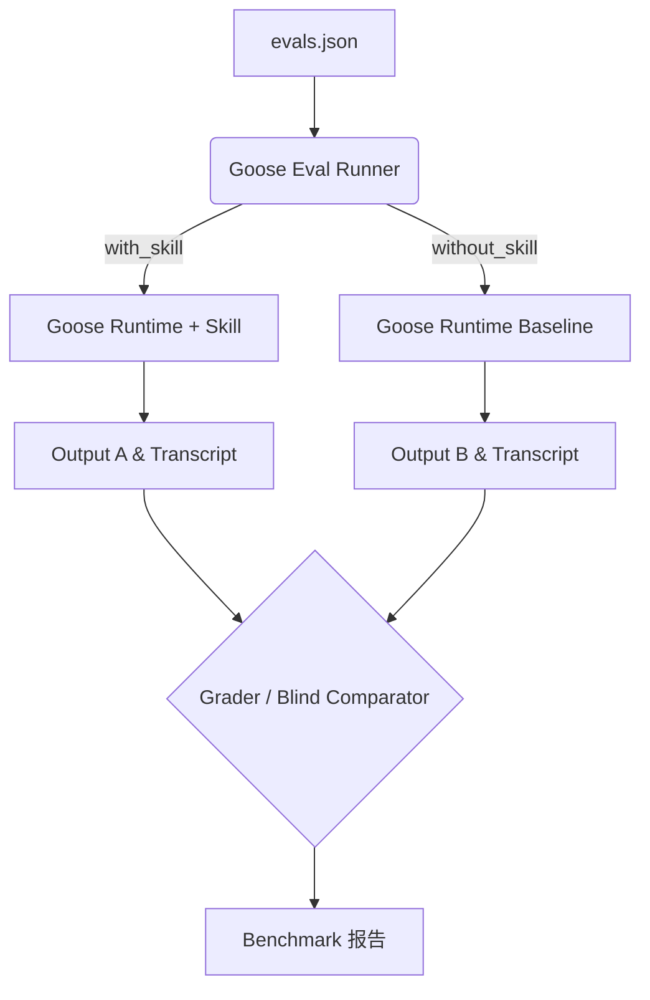

 

在使用 Block 开源的 Goose 框架开发 AI Agent 能力时，我们面临着一个不可回避的工程挑战：**如何系统化地测试和评估一个 Goose Skill 的质量？**

当前的现状是：**业界尚不存在一个成熟到可以直接运行类似 `goose eval skill xxx` 的官方评测基准系统。**

然而，通过对现有 Agent 评测生态的深度拆解，我们发现：**最现实且高效的方案并非从头重新发明一套 Evaluator，而是复用 Anthropic `skill-creator` 成熟的测评方法论，并将其底层的 Executor 替换为 Goose。**

本文将详细拆解这一评估体系的设计思路与技术架构。

---

## 1. 现状评估：现有工具库的选型与定位

在构建评估体系前，我们对当前主流的工具和机制进行了对比评估：

| 工具/项目                         | Skill 评估能力 | 适配 Goose 运行时 | A/B 盲测与 Benchmark | 综合推荐度 | 定位说明                       |
| :---------------------------- | :--------: | :----------: | :---------------: | :---: | :------------------------- |
| **Anthropic `skill-creator`** |    ✅ 极强    | ❌ 仅限 Claude  |      ✅ 完整支持       | ⭐⭐⭐⭐⭐ | 最佳方法论与评测框架来源               |
| **Goose 官方测试/CI**             |   ⚠️ 较弱    |     ✅ 原生     |       ⚠️ 缺失       |  ⭐⭐⭐  | 仅适用于测试 Goose 本体而非 Skill 质量 |
| **AgentSkills `skills-ref`**  |    ❌ 无     |      —       |         —         | ⭐⭐⭐⭐  | 仅用于 `SKILL.md` 规范的静态语法验证   |
| **自建 Goose Eval Harness**     |    ✅ 完整    |     ✅ 原生     |      ✅ 完整支持       | ⭐⭐⭐⭐⭐ | **当前最佳工程实践方案**             |

*注：不要将 Goose 自身的 CI 测试体系与单一 Skill 的质量评估混为一谈。前者测试的是 Agent 框架的基础能力，后者测试的是特定业务工具的执行效果。*

---

## 2. 为什么选择 Anthropic 的测评范式？

Anthropic 在其 `skill-creator` 中定义了一套极高水准的“改善-测试-评估”闭环（Evaluation Loop）。其核心优势在于引入了 LLM-as-a-judge 机制，包括：

1. **Grader（评分器）**：针对预设的 Expectation（期望结果），判断最终输出是 PASS 还是 FAIL，并强制要求大模型给出 Evidence（证据）。
2. **Blind Comparator（盲测对比器）**：在不告知大模型哪个输出带有 Skill、哪个未带 Skill（或 v1 与 v2 版本对比）的情况下，从准确性、完整性、可用性等维度盲选最优解。
3. **Benchmark（基准测试）**：统计并对比 `with_skill` 和 `without_skill` 在 Pass Rate（通过率）、Latency（耗时）、Tokens（消耗）上的差异（Delta）。

**关键限制与现状澄清：**
值得注意的是，2026年 GitHub 上的 `anthropics/skills` 开源仓库与 Claude.ai 内部版本存在差异（如 GitHub Issue #397 所证实，开源版缺少部分自动 eval 和 benchmark 模式）。此外，它原生的执行器被硬编码为 `claude-with-access-to-the-skill`。因此，我们不能直接拿它来跑测试，而是要**提取其数据结构与评测思想**。

---

## 3. 核心架构：解耦与替换（The Thin Runner 方案）

我们的核心解法是：**保持上层评测逻辑不变，仅将底层的运行时（Runtime）替换为 Goose。**

这意味着我们只需开发一个极轻量级的 **Goose Eval Harness（Goose 测评挂载器）**，它的工作流如下：



### 极简的数据结构复用
我们完全可以照搬 Anthropic 的 `evals.json` 测试用例结构：

```json
{
  "skill_name": "example-skill",
  "evals": [
    {
      "id": 1,
      "prompt": "用户的测试 Prompt",
      "expected_output": "对预期结果的描述",
      "expectations": [
        "输出结果中包含关键数据 X",
        "技能成功调用了脚本 Y"
      ]
    }
  ]
}
```

### 自定义 Goose Runner 的职责
这个 Runner 本质上是一个只需几百行代码的粘合剂，它负责：
1. 初始化干净的 Workspace 环境。
2. 安装并加载目标 Skill。
3. 给 Goose 发送 Prompt 并唤起执行。
4. **抓取 Output 和执行轨迹（Transcript）。**
5. 记录耗时与 Token 使用量。
6. 将数据打包抛给 Grader 模块打分。

由于 Grader 评判时**只看 Prompt、Transcript 和 Output**，它完全不需要知道执行动作的是 Claude 还是 Goose。这就实现了评测层与运行层的完美解耦。

---

## 4. 全景技术栈图谱（POC 推荐方案）

基于上述逻辑，我们最终确立了以下 5 层技术栈。这也是当前开发 Goose Skill 评估系统（POC）最清晰、最具可行性的架构蓝图：

1. **Skill Engineering Layer（技能工程层）**
   * **工具**：Anthropic Skill Creator
   * **作用**：利用 Claude 强大的代码能力，快速生成并迭代 Skill 的初始逻辑和测试用例。
2. **Skill Specification Layer（规范约束层）**
   * **工具**：AgentSkills (Validator)
   * **作用**：确保生成的 `SKILL.md` 符合跨平台互操作标准。
3. **Target Runtime Layer（目标运行时）**
   * **工具**：Goose
   * **作用**：作为真正的 Agent 底座，去执行真实的 Terminal 指令或 MCP 调用。
4. **Evaluation Layer（执行评测层 - 需自建）**
   * **工具**：Goose Eval Harness（解析 `evals.json` + 调用 Goose + 收集数据）。
5. **Quality Assessment Layer（质量打分层）**
   * **工具**：Grader / Comparator / Analyzer 模型链。
   * **作用**：基于 Goose 的运行轨迹生成包含 Pass rate、Tokens 和 Latency Delta 的 `benchmark.json`。

## 结语

不要被“寻找一个现成的 Goose Eval 框架”这个伪需求困住。当前最高效的工程路径就是：**“Anthropic 的测评灵魂 + Goose 的执行肉体”**。

通过实现一个极薄的 Goose Eval Harness 挂载器，不仅能以最低成本构建出企业级的 AI Skill CI/CD 流程，还能充分享受 LLM-as-a-judge 带来的科学盲测与基准对比能力。这套体系一旦建立，将极大加速基于 Goose 的 Agent 生态开发效率。